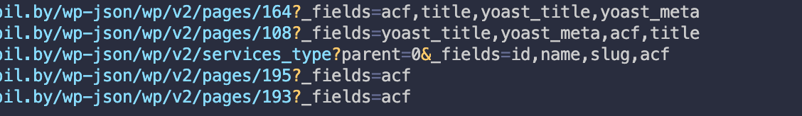

# `@reslear/axios-log`

Axios interceptor logger for requests query parameters
👍 zero config
👍 lightweight
👍 use [chalk]https://github.com/chalk/chalk

## Usage

```ts
import axios from "axios";
import axiosLog from "@reslear/axios-log";

axios.interceptors.request.use(axiosLog);
```


